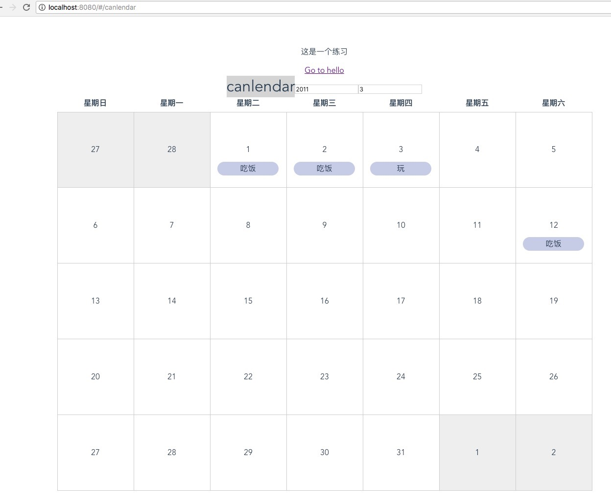

# 学vue的小demo，还没写完。
主要函数：
```
var arr = []
      // 这个月的第一天星期几
      var fistday = (new Date(this.year, this.month - 1, 1)).getDay()
      var f = fistday
      // 这个月几天
      var y = this.month === 12 ? this.year + 1 : this.year
      var m = this.month === 12 ? 1 : this.month
      var num = new Date(new Date(y, m, 1) - 1).getDate()
      // 上个月的最后一天是几号
      var lastday = new Date(new Date(this.year, this.month - 1, 1) - 1).getDate()
      var sum = num + fistday > 35 ? 42 : 35
      while (fistday-- > 0) {
        arr.unshift({'day': lastday--, 'other': 1})
      }
      var count = 1
      while (num-- > 0) {
        arr.push({'day': count++})
      }
      var countB = 1
      while (sum - arr.length > 0) {
        arr.push({'day': countB++, 'other': 1})
      }
      this.res.forEach(r => {
        var i = r.date ? parseInt(r.date.split('-')[2]) + parseInt(f) : null
        arr[i - 1]['do'] = 1
        arr[i - 1]['title'] = r.title
      })
      this.box = arr
```
效果截图：

